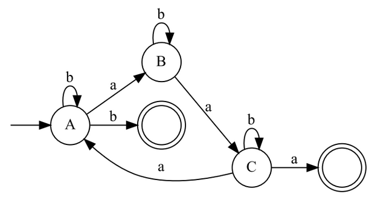

# RG2NFA
Convert Regular Grammar to Non Finite Automata using Graphviz

## CODE EXECUTION
- `python src.py` (Windows)
- `python3 src.py` (Linux)

## PROCEDURE FOR EXECUTION
1. ENTER THE CORRECT REGULAR GRAMMAR (L-R) AS WRITTEN ON PAPER (EVEN THE SLIGHTEST ALTERATION CAN CAUSE AN ERROR)
2. WAIT FOR THE FILE TO RENDER
3. OUTPUT FILE SHOWN

## SAMPLE OUTPUT
```
Regular grammar to Finite Automata: here's λ. Enter -1 for end of input
A->aB|bA|b
B->aC|bB
C->aA|bC|a
```

EXPORT FORMAT: PDF
